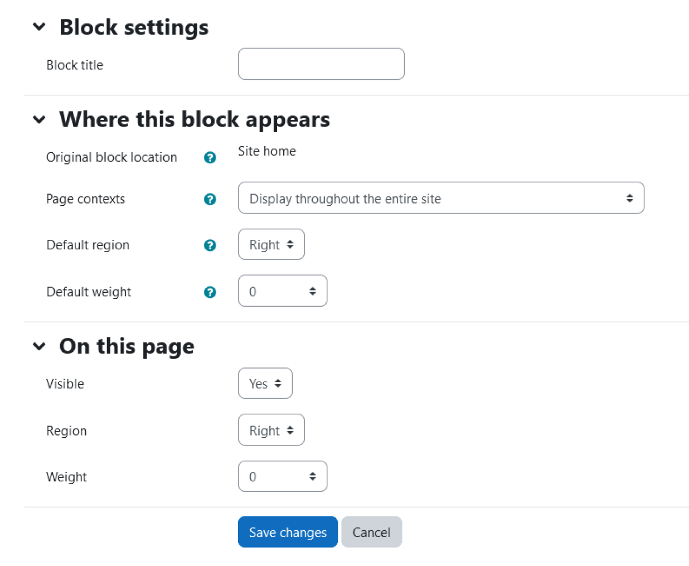
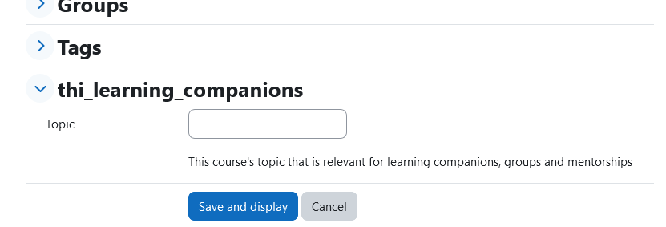
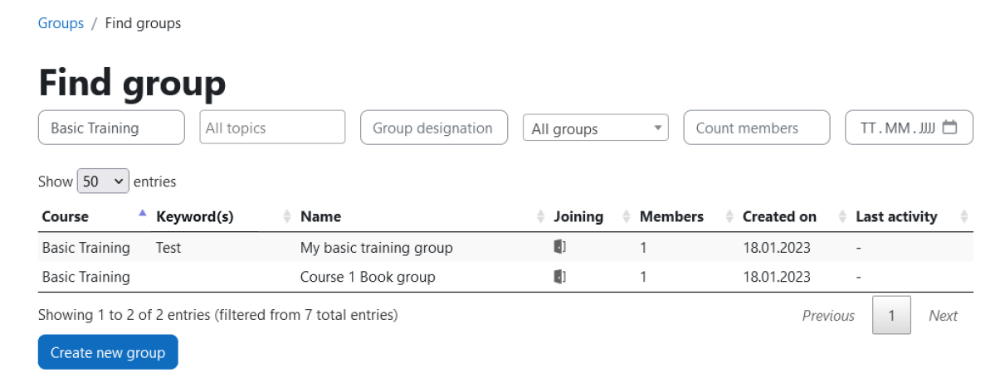
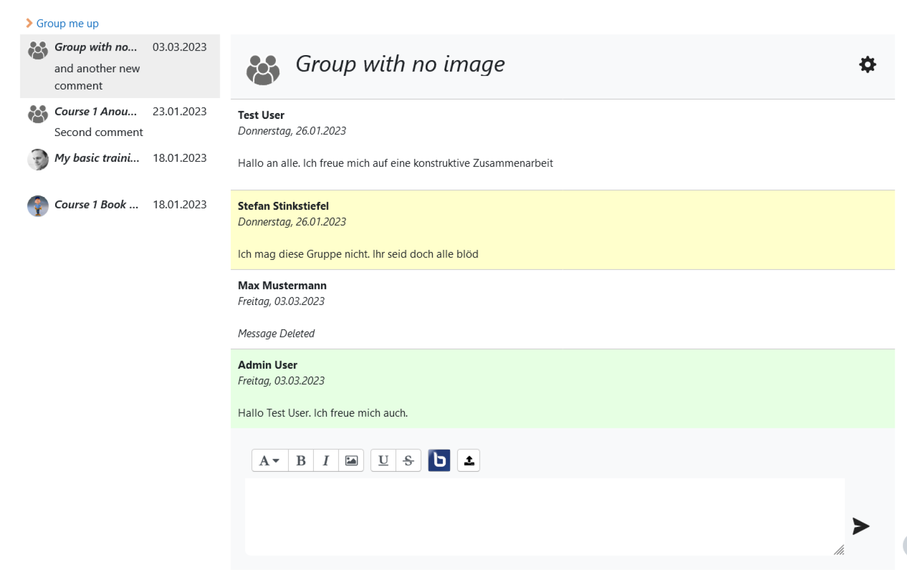
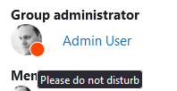

# Learning Companions #

# Technische Hochschule
## Ingolstadt
### Learning Companions
#### User Documentation

Created for: Technische Hochschule Ingolstadt 
Created by: ICON Vernetzte Kommunikation GmbH 
Version: 1.0 
As of 31st of May 2024

The THISuccessAI project (FBM202-EA-1690-07540) is funded by the Foundation „Innovation in der Hochschulehre“ as part of the funding line „Hochschulen durch Digitalisierung stärken“.

##### Introduction

The Learning Companions consist of three Moodle plugins whose purpose is to connect students with each other via direct exchange possibilities.

Students can create groups on their topics in which they can chat with each other to provide mutual assistance. Groups can be open or closed. Open groups can be read by anyone and anyone can join open groups.
Closed groups require students to apply and be unlocked before they can see who is in the group, what has been written in the group so far and before they can join the chat themselves.

Students seeking expert advice can specifically contact mentors with their questions. Students can qualify for the mentor role by acquiring the necessary badges.

In addition, they can interact with each Learning Nugget (Moodle activity) via a comment block.

The three plugins that make up Learning Companions are:
local_thi_learning_companions - this plugin does most of the work. It provides the group chats and group searches, mentor chats and searches, and adding the comment blocks to the Learning Nuggets.
block_thi_learning_companions_mygroups - this is a block plugin that is used for navigation and to jump from any Moodle page to the group and mentor searches and chats.
tool_thi_learning_companions - this plugin provides administration functionality that allows users with higher rights (admins/managers) to delete reported posts and manage all groups.

##### Quick start

###### Installing the plugins

Like all Moodle plugins, these just need to be copied to the appropriate place in the directory tree.
local_thi_learning_companions must be in local/thi_learning_companions, block_thi_learning_companions_mygroups in blocks/thi_learning_companions_mygroups and tool_thi_learning_companions in admin/tool/thi_learning_companions.

After the plugins have been moved to the appropriate places, you log in as an administrator and are automatically prompted to update, as Moodle recognises the new plugins on its own.

At the end of the update process, a form is displayed with the newly recognised settings. A detailed documentation of all settings and their meaning can be found at the end of this document.

###### Adding the Block Plugin

In order for the block plugin block_thi_learning_companions to be displayed on all pages, it must be added to the start page (/?redirect=0).

Then configure the block. In the section „Where this block appears“ select for „Page contexts“ the option „Display throughout the entire site“. This block is displayed for all users on all pages.

This block adds all the links to the Learning Companions features on the right-hand column:

The groups to which you belong are listed at the top. For each group, the group picture, the group title, as well as the last comment and the date of the last comment in the group are displayed. The group title is linked to the corresponding group chat.
If you belong to more than three groups, only three will be displayed at first. Additional groups can be displayed by clicking on „Show (x) more groups“.

The „Group me up“ link refers to a page on which users can create new groups, search for groups and join them, or apply to join closed groups.

The link „Go to admin area“ is only displayed to users with extended rights. The authorisation required for this is „local_thi_learning_companions:group_manage“. By default, all administrators and users with the role „manager“ receive this authorisation when the plug-in is installed. In the admin area, reported contributions can be managed and orphaned groups can be deleted.

Under „My Mentors“, you can jump to the list of questions you have asked mentors or submit new questions.

The section „My mentorship“ is only visible to users with the role „Mentor“ or who are qualified for this role. On the „My mentorships“ page, you can see the topics for which you are already registered as a mentor and for which you can still activate yourself as a mentor. A prerequisite for being activated as a mentor for a topic is receiving a special badge. More on this below. „Go to overview“ leads to the questions that have been asked of the mentor and the open questions that have been asked of all mentors, provided one is registered as a mentor for the associated topic. Also displayed are the latest comments on learning nuggets from courses in one‘s own topic.

###### Course topics

The plugin local/thi_learning_companions adds a new course custom field: „Topic“.
Edit your courses and enter the associated topic there. These topics determine for which topic a mentor is qualified if he/she has earned a corresponding badge in the course.

###### Configure Badges

To become a mentor for a topic, one must have earned a specific badge in a course of that topic. Which badges qualify for this role is defined in the plugin settings of the plugin local_thi_learning_companions.
These settings can be found under Site administration > General > Learning Companions > Local plugin local_thi_learning_companions or the URL admin/settings.php?section=local_thi_learning_companions.
There you will find the setting „Mentor badges“:

Here you can enter several terms, separated by commas, which must be part of the badge name. 

If a user receives a badge with one of these terms in its name, he or she has thus qualified as a mentor for the subject of the course, is informed of this via a Moodle message and can decide for himself or herself whether to accept this role (via the page „My mentorship > Manage mentorship(s)“).

The badge name doesn't have to match exactly. For example if the setting is set to "expert", then a badge with the name "IT Expert" matches too, since it contains the word "expert". The match is case insensitive. 

###### Group me up

If the block block_thi_learning_companions_mygroups has been added as described above, 
then users can jump from any page to the page „Groups > Find Group“ via the link „Group me up“ in this block.

When I jump to this page from a course or course module, the list of groups is already pre-filtered by the current course.
By removing this filter (here „Basic Training“ in the screenshot below) one can then get the whole list of available groups again. 

The icon in the „Joining“ column indicates whether the group is open or closed.
Anyone can join an open group or view the chats without being a member of the group.
For closed groups, you have to request to join.

###### Create a group

If I have not found a group in the table on the „Find group“ page that meets my needs, I can create a new group myself using the „Create new group“ button.
A form opens in which I can enter all the relevant information about the group. 

The **group name** is displayed in the group search and overview of my groups. It should describe as precisely and concisely as possible what the group is about. It is the only mandatory field.

The field „**Keyword(s)**“ can be filled freely. It does not have to be congruent with the topic of the course.
This is an autocomplete field with tagging function. This means that suggestions appear while you are typing that contain the text you have entered.
By clicking on such a suggestion, it is taken over. You can also create new topics by entering the text as usual and pressing Return(Enter). Several topics can be added.

**Course context** is pre-filled with the course I came from when I arrived here via a course. 
Multiple selection is not possible here. Like all fields except Group name, this field is optional.
The field can be useful when users are looking for a group that is relevant to a particular course.

**Learning nugget context** is also an autocomplete field. 
Here, activities (learning nuggets) are available that are included in the course selected for „Course context“.

With the option „**Closed group**“ I can define whether everyone can/may visit the group or a membership has to be applied for and approved.

A **group picture** can be uploaded. It appears in the overviews and helps to distinguish the groups from each other more quickly. If no picture is uploaded, a placeholder picture is displayed instead.

###### Group-Chat

In the group chat, users can write texts and apply simple formatting such as bold, italic, underlined and strikethrough. 
They can also upload pictures and files or start a video conference using the BigBlueButton. The buttons for file upload and BigBlueButton are currently only available for the ATTO editor.

Own comments are highlighted in green, reported comments in yellow. Deleted comments appear in the chat with the text „Message deleted“ replaced.
Hovering over the comments gives you the option to report posts or delete your own.

###### Online Status

The plugin local_thi_learning_companions adds a new profile field: "Learning companions user status". It can be set to one of three options: "Online", "Offline" and "Please do not disturb".

By default, unless manually overridden by the user, it will be set to the current login status of the user.

Wherever group members get listed, the user status will be indicated with a colored circle above the user image. Green indicates "Online", grey means "Offline" and a red is for "Please do not disturb". 
When you hover over that colored circle, a tooltip will show the meaning of the status color code.

###### Plugin-Settings

local_thi_learning_companions

Group image max filesize (local_thi_learning_companions | groupimage_maxbytes) 
Default value: 1000000

This value determines the maximum file size that a group picture may have. Users who create groups have the option of uploading a picture for their group. Since there can theoretically be very many groups, it makes sense to limit the maximum upload size. The value given here is in bytes. The default value of 1000000 is therefore 1MB.

Add comment block to activities (local_thi_learning_companions | commentactivities) 
Default: assign,assignment,book,choice,data,feedback,folder,glossary,h5pactivity,lesson,lit,quiz,resource,page,scorm,survey,workshop

In order for learners to be able to exchange information about the Learning Nuggets, the plugin adds a comment block to each Learning Nugget. Under certain circumstances, such a comment block is not desired for all Learning Nugget activity types. For example, because the comment block is distracting or does not fit well into the layout for the activity. Therefore, this setting can be used to specify which activities should automatically receive a comment block.

Mentor badges (local_thi_learning_companions | badgetypes_for_mentors) 
Default: expert

Users can be qualified to become a mentor for a topic by receiving certain badges. In order for the platform to know which badge qualifies for this role, at least one badge name must be entered here. It does not have to be the full badge name, but a component of the name is sufficient. I.e. if, for example, the default value „expert“ is kept, then a user can qualify to become a mentor by receiving a badge called „Expert in IT“ or „Maths Expert“. Upper and lower case letters are ignored. Multiple badge names can be entered, separated by commas.

Minimum ratings to become supermentor (local_thi_learning_companions | supermentor_minimum_ratings) 
Default: 10

Through positive ratings in mentor chats, mentors can advance to supermentor. The value given here determines how many positive ratings are needed to obtain the status of supermentor.

Latest comments: Max. amount (local_thi_learning_companions | latest_comments_max_amount) 
Default: 20

Mentors can display the list of the most recent comments on their topic. The value given here indicates how many comments are displayed.

Upload limit per message (local_thi_learning_companions | upload_limit_per_message) 
Default: 5

In group chats, users can upload files. The sum of the files uploaded in a message must not exceed the specified number of MB.

Upload limit per chat (local_thi_learning_companions | upload_limit_per_chat) 
Default: 100

The total amount of uploaded files in a group chat must not exceed the number of MB specified here. If the value is reached, no more files can be uploaded in this chat.

Inform tutors about unanswered questions after x days (local_thi_learning_companions | inform_tutors_about_unanswered_questions_after_x_days) 
Default: 14

Learners can ask questions to individual mentors or open questions to all mentors. If such a question remains unanswered for a longer period of time, a tutor is automatically informed about it. The value specified here determines after how many days this happens. 

Shortname of tutor role (local_thi_learning_companions | tutorrole_shortname) 
Default: teacher

As mentioned above, tutors are automatically notified about questions that have remained unanswered for a longer period of time. The value here defines which role a user must have in order to be considered a tutor and to receive the notification. The role short name must be specified.
The settings for the plugin local_thi_learning_companions can be edited at any time via the URL admin/settings.php?section=local_thi_learning_companions.

The Admin Tool and the Block Plugin have no settings.

## Installing via uploaded ZIP file ##

1. Log in to your Moodle site as an admin and go to _Site administration >
   Plugins > Install plugins_.
2. Upload the ZIP file with the plugin code. You should only be prompted to add
   extra details if your plugin type is not automatically detected.
3. Check the plugin validation report and finish the installation.

## Installing manually ##

The plugin can be also installed by putting the contents of this directory to

    {your/moodle/dirroot}/local/thi_learning_companions

Afterwards, log in to your Moodle site as an admin and go to _Site administration >
Notifications_ to complete the installation.

Alternatively, you can run

    $ php admin/cli/upgrade.php

to complete the installation from the command line.

## License ##

2022 ICON Vernetzte Kommunikation GmbH <info@iconnewmedia.de>

This program is free software: you can redistribute it and/or modify it under
the terms of the GNU General Public License as published by the Free Software
Foundation, either version 3 of the License, or (at your option) any later
version.

This program is distributed in the hope that it will be useful, but WITHOUT ANY
WARRANTY; without even the implied warranty of MERCHANTABILITY or FITNESS FOR A
PARTICULAR PURPOSE.  See the GNU General Public License for more details.

You should have received a copy of the GNU General Public License along with
this program.  If not, see <https://www.gnu.org/licenses/>.
